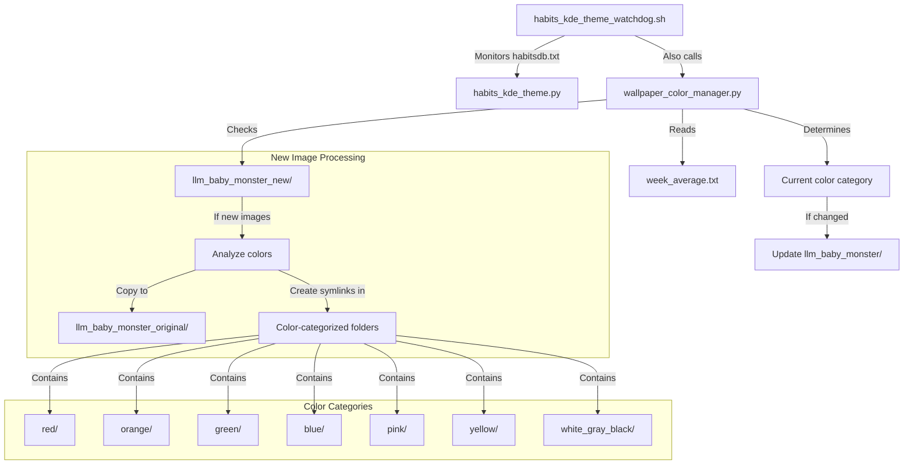

# Wallpaper Color Manager Implementation Plan

## Overview

This document outlines the implementation plan for a wallpaper color management system that integrates with an existing habit tracking system. The system will analyze images based on their dominant colors, categorize them into color-specific directories, and update the KDE wallpaper slideshow directory based on the user's weekly habit average.

## System Architecture



## Directory Structure

```
/home/twain/Pictures/
├── llm_baby_monster/                 # Original directory (KDE looks here)
├── llm_baby_monster_original/        # Master copy of all images
├── llm_baby_monster_new/             # Directory for new images awaiting analysis
├── llm_baby_monster_by_color/        # Color-categorized directories
│   ├── red/
│   ├── orange/
│   ├── green/
│   ├── blue/
│   ├── pink/
│   ├── yellow/
│   └── white_gray_black/
└── llm_baby_monster_current/         # Current active color directory
```

## Color Categorization Rules

Images will be categorized based on the following weekly average habit count ranges:

- **Red**: count < 13
- **Orange**: 13 < count <= 20
- **Green**: 20 < count <= 30
- **Blue**: 30 < count <= 41
- **Pink**: 41 < count <= 48
- **Yellow**: 48 < count <= 55
- **White/Gray/Black/Colorless**: count > 55 or doesn't fit other categories

## Important Categorization Principles

1. **Single Category Assignment**: Each image will be placed in exactly one color folder based on its dominant color. No image will appear in multiple color categories.

2. **Complete Categorization**: Every image will be analyzed and placed into one of the seven color categories. No images will be skipped or left uncategorized.

3. **Default Category**: If an image doesn't clearly fall into one of the first six color categories, it will default to the "white/gray/black/colorless" category.

## Implementation Components

### 1. Directory Setup Script

```python
import os
import shutil

def setup_directory_structure():
    """
    Create the necessary directory structure for the wallpaper color management system.
    """
    base_dir = "/home/twain/Pictures"
    
    # Define all directories
    directories = [
        "llm_baby_monster_original",
        "llm_baby_monster_new",
        "llm_baby_monster_by_color",
        "llm_baby_monster_by_color/red",
        "llm_baby_monster_by_color/orange",
        "llm_baby_monster_by_color/green",
        "llm_baby_monster_by_color/blue",
        "llm_baby_monster_by_color/pink",
        "llm_baby_monster_by_color/yellow",
        "llm_baby_monster_by_color/white_gray_black",
        "llm_baby_monster_current"
    ]
    
    # Create directories if they don't exist
    for directory in directories:
        full_path = os.path.join(base_dir, directory)
        if not os.path.exists(full_path):
            os.makedirs(full_path)
            print(f"Created directory: {full_path}")
    
    # Copy existing images to original directory if it's empty
    original_dir = os.path.join(base_dir, "llm_baby_monster_original")
    source_dir = os.path.join(base_dir, "llm_baby_monster")
    
    if os.path.exists(source_dir) and not os.listdir(original_dir):
        for filename in os.listdir(source_dir):
            if filename.endswith(('.jpg', '.jpeg', '.png')):
                source_file = os.path.join(source_dir, filename)
                dest_file = os.path.join(original_dir, filename)
                shutil.copy2(source_file, dest_file)
        print(f"Copied existing images to {original_dir}")
```

### 2. Image Color Analysis Module

```python
from PIL import Image
import numpy as np
from sklearn.cluster import KMeans
import os
import json

# Define color ranges in RGB
COLOR_RANGES = {
    "red": [(150, 0, 0), (255, 100, 100)],
    "orange": [(150, 75, 0), (255, 200, 100)],
    "green": [(0, 150, 0), (100, 255, 100)],
    "blue": [(0, 0, 150), (100, 100, 255)],
    "pink": [(150, 0, 150), (255, 100, 255)],
    "yellow": [(150, 150, 0), (255, 255, 100)],
    "white_gray_black": [(0, 0, 0), (255, 255, 255)]  # This is a catch-all
}

def analyze_image_color(image_path):
    """
    Analyze an image to determine its dominant color category.
    
    Args:
        image_path: Path to the image file
        
    Returns:
        String representing the color category
    """
    try:
        # Open image and resize for faster processing
        img = Image.open(image_path)
        img = img.resize((100, 100))
        img = img.convert('RGB')
        
        # Convert image to numpy array
        img_array = np.array(img)
        img_array = img_array.reshape((img_array.shape[0] * img_array.shape[1], 3))
        
        # Use k-means clustering to find dominant colors
        kmeans = KMeans(n_clusters=5)
        kmeans.fit(img_array)
        
        # Get the colors and their percentages
        colors = kmeans.cluster_centers_
        labels = kmeans.labels_
        label_counts = np.bincount(labels)
        percentages = label_counts / len(labels)
        
        # Combine colors and percentages
        color_percentages = list(zip(colors, percentages))
        
        # Sort by percentage (descending)
        color_percentages.sort(key=lambda x: x[1], reverse=True)
        
        # Determine the dominant color category
        dominant_color = color_percentages[0][0]
        
        # Map RGB to color category
        return map_rgb_to_category(dominant_color)
        
    except Exception as e:
        print(f"Error analyzing image {image_path}: {e}")
        return "white_gray_black"  # Default to this category on error

def map_rgb_to_category(rgb):
    """
    Map an RGB color to one of our predefined categories.
    
    Args:
        rgb: Numpy array of RGB values
        
    Returns:
        String representing the color category
    """
    # Calculate distance to each color range
    min_distances = {}
    
    for category, ranges in COLOR_RANGES.items():
        min_range, max_range = ranges
        
        # Check if color is within range
        if all(min_range[i] <= rgb[i] <= max_range[i] for i in range(3)):
            return category
        
        # Calculate minimum distance to range
        min_dist = 0
        for i in range(3):
            if rgb[i] < min_range[i]:
                min_dist += (min_range[i] - rgb[i]) ** 2
            elif rgb[i] > max_range[i]:
                min_dist += (rgb[i] - max_range[i]) ** 2
        
        min_distances[category] = min_dist
    
    # Return category with minimum distance
    return min(min_distances.items(), key=lambda x: x[1])[0]

def process_new_images(new_dir, original_dir, color_dirs):
    """
    Process new images, analyze their colors, and organize them.
    
    Args:
        new_dir: Directory containing new images
        original_dir: Directory to store original copies
        color_dirs: Dictionary mapping color categories to directories
    
    Returns:
        Number of images processed
    """
    processed_count = 0
    
    for filename in os.listdir(new_dir):
        if filename.lower().endswith(('.jpg', '.jpeg', '.png', '.gif')):
            image_path = os.path.join(new_dir, filename)
            
            # Analyze color
            color_category = analyze_image_color(image_path)
            
            # Copy to original directory
            original_path = os.path.join(original_dir, filename)
            os.system(f"cp '{image_path}' '{original_path}'")
            
            # Create symlink in appropriate color directory
            color_dir = color_dirs[color_category]
            symlink_path = os.path.join(color_dir, filename)
            
            # Remove existing symlink if it exists
            if os.path.exists(symlink_path):
                os.remove(symlink_path)
                
            # Create new symlink
            os.symlink(original_path, symlink_path)
            
            # Remove from new directory
            os.remove(image_path)
            
            processed_count += 1
            
    return processed_count
```

### 3. Main Wallpaper Manager Script

```python
#!/usr/bin/env python3

import os
import sys
import json
import logging
import shutil
import time
from datetime import datetime

# Import our modules
# from directory_setup import setup_directory_structure
# from image_analysis import process_new_images, analyze_image_color

# Setup logging
logging.basicConfig(
    filename='/home/twain/logs/wallpaper_manager.log',
    level=logging.INFO,
    format='%(asctime)s - %(levelname)s - %(message)s'
)

# Constants
BASE_DIR = "/home/twain/Pictures"
WEEK_AVERAGE_FILE = "/home/twain/noteVault/habitCounters/week_average.txt"
STATE_FILE = os.path.join(BASE_DIR, "llm_baby_monster_current", "state.json")

# Color category directories
COLOR_DIRS = {
    "red": os.path.join(BASE_DIR, "llm_baby_monster_by_color", "red"),
    "orange": os.path.join(BASE_DIR, "llm_baby_monster_by_color", "orange"),
    "green": os.path.join(BASE_DIR, "llm_baby_monster_by_color", "green"),
    "blue": os.path.join(BASE_DIR, "llm_baby_monster_by_color", "blue"),
    "pink": os.path.join(BASE_DIR, "llm_baby_monster_by_color", "pink"),
    "yellow": os.path.join(BASE_DIR, "llm_baby_monster_by_color", "yellow"),
    "white_gray_black": os.path.join(BASE_DIR, "llm_baby_monster_by_color", "white_gray_black")
}

def get_color_from_count(count):
    """
    Determine color category based on habit count.
    """
    if count < 13:
        return "red"
    elif 13 < count <= 20:
        return "orange"
    elif 20 < count <= 30:
        return "green"
    elif 30 < count <= 41:
        return "blue"
    elif 41 < count <= 48:
        return "pink"
    elif 48 < count <= 55:
        return "yellow"
    else:
        return "white_gray_black"

def get_weekly_average():
    """
    Read the weekly average from the file.
    """
    try:
        with open(WEEK_AVERAGE_FILE, 'r') as f:
            return float(f.read().strip())
    except Exception as e:
        logging.error(f"Error reading weekly average: {e}")
        return 0

def get_current_state():
    """
    Read the current state from the state file.
    """
    if not os.path.exists(STATE_FILE):
        return {"last_color": None, "last_update": None}
    
    try:
        with open(STATE_FILE, 'r') as f:
            return json.load(f)
    except Exception as e:
        logging.error(f"Error reading state file: {e}")
        return {"last_color": None, "last_update": None}

def save_current_state(color):
    """
    Save the current state to the state file.
    """
    state = {
        "last_color": color,
        "last_update": datetime.now().isoformat()
    }
    
    try:
        with open(STATE_FILE, 'w') as f:
            json.dump(state, f, indent=2)
    except Exception as e:
        logging.error(f"Error saving state file: {e}")

def update_wallpaper_directory(color):
    """
    Update the KDE wallpaper directory to point to the appropriate color directory.
    """
    wallpaper_dir = os.path.join(BASE_DIR, "llm_baby_monster")
    color_dir = COLOR_DIRS[color]
    
    try:
        # Check if there are images in the color directory
        if not os.listdir(color_dir):
            logging.warning(f"No images in {color} directory. Using white_gray_black instead.")
            color = "white_gray_black"
            color_dir = COLOR_DIRS[color]
        
        # Clear existing wallpaper directory
        for item in os.listdir(wallpaper_dir):
            item_path = os.path.join(wallpaper_dir, item)
            if os.path.islink(item_path) or os.path.isfile(item_path):
                os.remove(item_path)
        
        # Create symlinks to all images in the color directory
        for filename in os.listdir(color_dir):
            source = os.path.join(color_dir, filename)
            target = os.path.join(wallpaper_dir, filename)
            os.symlink(source, target)
        
        logging.info(f"Updated wallpaper directory to {color} category")
        return True
    except Exception as e:
        logging.error(f"Error updating wallpaper directory: {e}")
        return False

def main():
    try:
        # Ensure directory structure exists
        setup_directory_structure()
        
        # Process any new images
        new_dir = os.path.join(BASE_DIR, "llm_baby_monster_new")
        original_dir = os.path.join(BASE_DIR, "llm_baby_monster_original")
        processed_count = process_new_images(new_dir, original_dir, COLOR_DIRS)
        
        if processed_count > 0:
            logging.info(f"Processed {processed_count} new images")
        
        # Get weekly average and determine color
        weekly_average = get_weekly_average()
        current_color = get_color_from_count(weekly_average)
        
        # Get current state
        state = get_current_state()
        
        # Update wallpaper directory if color has changed
        if current_color != state["last_color"]:
            if update_wallpaper_directory(current_color):
                save_current_state(current_color)
                logging.info(f"Changed wallpaper color to {current_color} (weekly average: {weekly_average})")
        
    except Exception as e:
        logging.error(f"Unexpected error in main function: {e}")
        return 1
    
    return 0

if __name__ == "__main__":
    sys.exit(main())
```

### 4. Integration with Existing Watchdog

Modify the existing `habits_kde_theme_watchdog.sh` script to call our new wallpaper manager:

```bash
#!/bin/bash

echo "Script started at $(date)" >> /home/twain/logs/logfile.log

source /home/twain/miniconda3/etc/profile.d/conda.sh  # Replace with the path to your conda.sh
conda activate base

file_to_watch="$HOME/noteVault/habitsdb.txt"
python_script="$HOME/projects/tail/habits_kde_theme.py"
py_widget="$HOME/projects/py_habits_widget/py_widget.py"
get_habits_daily_totals="$HOME/projects/py_habits_widget/get_habits_daily_totals.py"
wallpaper_manager="$HOME/projects/tail/wallpaper_color_manager.py"  # Add this line

# Start the initial instance of python_widget
python3 "$py_widget" &

#this just updates the phones list of daily habits totals in case it gets off
python3 "$get_habits_daily_totals" &

# Run the wallpaper manager initially
python3 "$wallpaper_manager" &  # Add this line

# Watch for file changes
while true; do
    inotifywait -e modify "$file_to_watch"
    
    # Kill the previous instance of python_widget
    pkill -f "py_widget.py"
    
    # Run python_script
    python3 "$python_script"
    
    # Start python_widget again
    python3 "$py_widget" &

    #this just updates the phones list of daily habits totals in case it gets off
    python3 "$get_habits_daily_totals" &
    
    # Run the wallpaper manager
    python3 "$wallpaper_manager" &  # Add this line
done
```

## Initial Setup Process

1. Create the wallpaper_color_manager.py script with all necessary modules
2. Make it executable: `chmod +x wallpaper_color_manager.py`
3. Run it once to set up the directory structure and process existing images
4. Modify the habits_kde_theme_watchdog.sh script to include the wallpaper manager
5. Restart the watchdog script

## Testing and Validation

1. **Test Image Analysis**
   - Process a sample set of images with known dominant colors
   - Verify they are categorized correctly

2. **Test Directory Updates**
   - Manually change the weekly average value
   - Verify the wallpaper directory is updated correctly

3. **Test New Image Processing**
   - Add new images to the llm_baby_monster_new directory
   - Verify they are processed and categorized correctly

4. **Test Integration**
   - Verify the wallpaper manager is called when habits are updated
   - Check logs for any errors or warnings

## Maintenance and Troubleshooting

- Check the log file at `/home/twain/logs/wallpaper_manager.log` for errors
- If images are not being categorized correctly, adjust the COLOR_RANGES in the image analysis module
- If the wallpaper directory is not being updated, check the state file and permissions

## Future Enhancements

1. **Web Interface**
   - Create a simple web interface to view and manually recategorize images

2. **Advanced Color Analysis**
   - Implement more sophisticated color analysis algorithms

3. **Performance Optimization**
   - Cache analysis results for faster processing
   - Implement parallel processing for large image sets