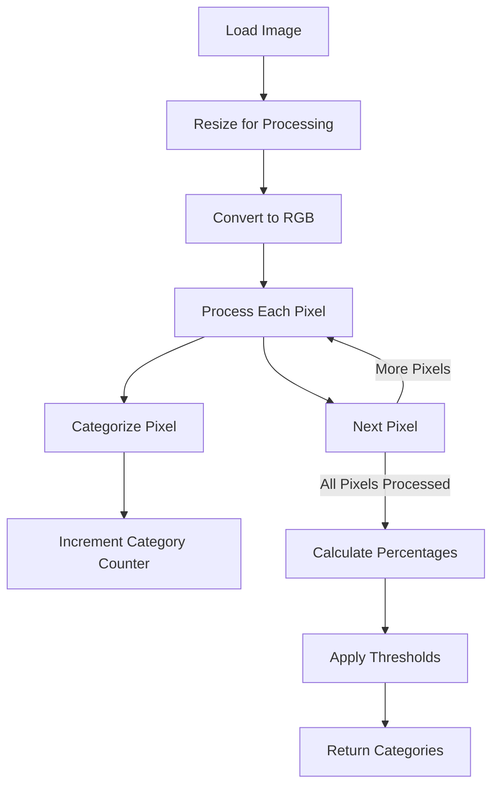

# Color Analysis Design

This document outlines the design of the Color Analysis module for the Wallpaper Color Manager system.

## Overview

The Color Analysis module is responsible for:

1. Analyzing images to determine their color distribution
2. Categorizing pixels into color categories
3. Calculating color percentages
4. Applying thresholds to determine which categories an image belongs to

## Color Analysis Approach



## Key Components

### 1. Pixel Categorization

The system will categorize each pixel into one of the seven color categories:

1. Red
2. Orange
3. Green
4. Blue
5. Pink
6. Yellow
7. White/Gray/Black

#### Categorization Algorithm

We'll use a combination of RGB and HSV color spaces for more accurate categorization:

```python
def categorize_pixel(r, g, b):
    """
    Determine which color category a pixel belongs to.
    
    Args:
        r (int): Red value (0-255)
        g (int): Green value (0-255)
        b (int): Blue value (0-255)
        
    Returns:
        str: Color category name
    """
    # Convert RGB to HSV for better color discrimination
    h, s, v = rgb_to_hsv(r, g, b)
    
    # Check for white/gray/black first (low saturation or extreme value)
    if s < 0.2 or v < 0.15 or v > 0.95:
        return "white_gray_black"
    
    # Categorize based on hue
    if 0 <= h < 30 or 330 <= h < 360:
        return "red"
    elif 30 <= h < 60:
        return "orange"
    elif 60 <= h < 150:
        return "green"
    elif 150 <= h < 210:
        return "blue"
    elif 210 <= h < 270:
        return "pink"
    elif 270 <= h < 330:
        return "yellow"
    else:
        return "white_gray_black"  # Fallback
```

### 2. Image Analysis

The image analysis process:

1. Loads and resizes the image for faster processing
2. Processes each pixel to determine its color category
3. Counts pixels in each category
4. Calculates percentages for each color

```python
def analyze_image(image_path, resize_dimensions=(100, 100)):
    """
    Analyze an image to determine its color distribution.
    
    Args:
        image_path (str): Path to the image file
        resize_dimensions (tuple): Dimensions to resize image for analysis
        
    Returns:
        dict: Color percentages and categories
    """
    # Load and resize image
    img = Image.open(image_path)
    img = img.resize(resize_dimensions)
    img = img.convert('RGB')
    
    # Initialize counters
    color_counts = {
        "red": 0,
        "orange": 0,
        "green": 0,
        "blue": 0,
        "pink": 0,
        "yellow": 0,
        "white_gray_black": 0
    }
    total_pixels = resize_dimensions[0] * resize_dimensions[1]
    
    # Process each pixel
    for x in range(resize_dimensions[0]):
        for y in range(resize_dimensions[1]):
            r, g, b = img.getpixel((x, y))
            category = categorize_pixel(r, g, b)
            color_counts[category] += 1
    
    # Calculate percentages
    color_percentages = {
        color: (count / total_pixels) * 100
        for color, count in color_counts.items()
    }
    
    return color_percentages
```

### 3. Threshold Application

The threshold application process:

1. Takes color percentages and threshold settings
2. Compares each color's percentage against its threshold
3. Returns a list of categories that meet or exceed their thresholds

```python
def apply_thresholds(color_percentages, thresholds):
    """
    Determine which categories an image belongs to based on thresholds.
    
    Args:
        color_percentages (dict): Percentage of each color in the image
        thresholds (dict): Threshold percentage for each color
        
    Returns:
        list: Categories the image belongs to
    """
    categories = []
    
    for color, percentage in color_percentages.items():
        if percentage >= thresholds.get(color, 10):  # Default to 10% if not specified
            categories.append(color)
    
    # Ensure at least one category is selected
    if not categories:
        # Find the color with the highest percentage
        max_color = max(color_percentages.items(), key=lambda x: x[1])[0]
        categories.append(max_color)
    
    return categories
```

## Performance Considerations

### 1. Image Resizing

- Smaller resize dimensions result in faster processing but less accurate results
- Larger dimensions provide more accurate results but slower processing
- Default dimensions of 100x100 provide a good balance

### 2. Caching

- Cache analysis results for previously processed images
- Store results in memory during a session
- Optionally persist results to disk for future sessions

### 3. Batch Processing

- Process multiple images in parallel using threading
- Show progress indicators for batch operations
- Allow cancellation of long-running operations

## Color Space Considerations

### RGB vs. HSV

- RGB (Red, Green, Blue) is the native color space of digital images
- HSV (Hue, Saturation, Value) better matches human perception of color
- Using HSV for categorization provides more intuitive results

### HSV Color Wheel

```
Hue values in degrees:
    0/360: Red
    60: Yellow
    120: Green
    180: Cyan
    240: Blue
    300: Magenta
```

### Color Boundaries

The boundaries between color categories are defined as:

- Red: 330° - 30°
- Orange: 30° - 60°
- Yellow: 60° - 90°
- Green: 90° - 150°
- Blue: 150° - 210°
- Pink/Purple: 210° - 330°
- White/Gray/Black: Based on saturation and value, not hue

## Testing and Validation

### 1. Test Images

- Create a set of test images with known color distributions
- Verify categorization against expected results
- Include edge cases (e.g., images with colors at category boundaries)

### 2. Performance Testing

- Measure processing time for different image sizes
- Optimize resize dimensions for best accuracy/performance trade-off
- Test with large batches of images to ensure scalability

### 3. User Validation

- Compare algorithm results with human perception
- Adjust category boundaries based on user feedback
- Ensure results match user expectations

## Future Enhancements

### 1. Machine Learning Approach

- Train a model on user-labeled images
- Use features beyond simple color values
- Improve categorization accuracy over time

### 2. Advanced Color Analysis

- Consider spatial distribution of colors
- Analyze foreground vs. background colors
- Detect patterns and textures

### 3. Custom Color Categories

- Allow users to define their own color categories
- Provide tools for training custom categorization
- Support more granular color distinctions