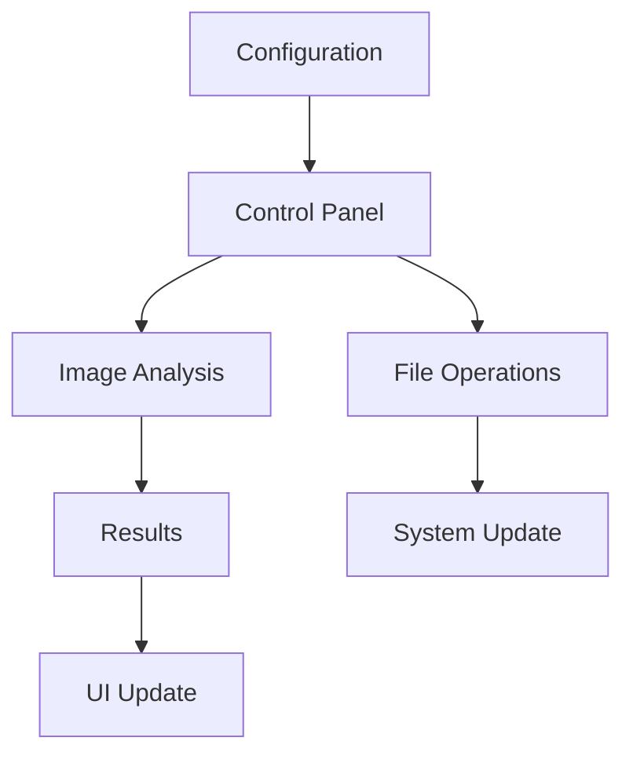

# Control Panel Design

This document outlines the design of the Control Panel for the Wallpaper Color Manager system.

## Overview

The Control Panel is a graphical user interface built with Tkinter that allows users to:

1. Adjust color threshold settings
2. View sample images and their color distributions
3. Preview categorization results
4. Reset color categories
5. Run the analysis process

## UI Layout

```
+-----------------------------------------------+
|  Wallpaper Color Manager - Control Panel      |
+-----------------------------------------------+
|                                               |
|  +-------------------+ +-------------------+  |
|  | Sample Image      | | Color Distribution|  |
|  |                   | |                   |  |
|  |                   | | [Bar Chart]       |  |
|  |                   | |                   |  |
|  |                   | |                   |  |
|  +-------------------+ +-------------------+  |
|                                               |
|  Categories: [Red] [Green] [White/Gray/Black] |
|                                               |
|  +-------------------------------------------+  |
|  | Color Thresholds                          |  |
|  |                                           |  |
|  | Red:     [===========|------] 55%         |  |
|  | Orange:  [=====|----------------] 25%     |  |
|  | Green:   [========|-------------] 40%     |  |
|  | Blue:    [====|------------------] 20%    |  |
|  | Pink:    [===|-------------------] 15%    |  |
|  | Yellow:  [======|--------------] 30%      |  |
|  | W/G/B:   [==========|--------] 50%        |  |
|  |                                           |  |
|  +-------------------------------------------+  |
|                                               |
|  [< Prev Image]                [Next Image >] |
|                                               |
|  [Reset Categories]            [Run Analysis] |
|                                               |
+-----------------------------------------------+
```

## Components

### 1. Main Window

- Title: "Wallpaper Color Manager - Control Panel"
- Size: 900x700 pixels (resizable)
- Layout: Grid-based layout with frames for different sections

### 2. Sample Image Viewer

- Location: Top-left section
- Size: 400x300 pixels
- Features:
  - Displays the current sample image
  - Scales image to fit while maintaining aspect ratio
  - Shows image filename and dimensions
  - Provides navigation buttons for cycling through sample images

### 3. Color Distribution Display

- Location: Top-right section
- Size: 400x300 pixels
- Features:
  - Bar chart showing percentage of each color in the current image
  - Horizontal bars with color-coded representation
  - Threshold markers showing current threshold settings
  - Percentage labels for each color

### 4. Category Indicators

- Location: Below the image and distribution display
- Features:
  - Visual indicators showing which categories the current image belongs to
  - Highlights categories that meet or exceed their thresholds
  - Updates in real-time when thresholds are adjusted

### 5. Threshold Adjustment Section

- Location: Middle section
- Features:
  - One slider per color category (7 total)
  - Range: 0-100%
  - Labels showing current percentage value
  - Color-coded to match the category
  - Real-time updates of categorization when adjusted

### 6. Navigation Controls

- Location: Bottom-left section
- Features:
  - Previous/Next buttons for cycling through sample images
  - Counter showing current image index (e.g., "3/12")
  - Option to add new sample images

### 7. Action Buttons

- Location: Bottom-right section
- Features:
  - Reset Categories: Clears all color folders and resets the system
  - Run Analysis: Processes all images with current settings
  - Save Configuration: Saves current settings to config file
  - Load Configuration: Loads settings from config file

## Interaction Flow

### 1. Startup

1. Load configuration from config.json
2. Initialize UI components
3. Scan sample_images directory
4. Load and analyze the first sample image
5. Update UI with initial analysis results

### 2. Adjusting Thresholds

1. User moves a threshold slider
2. System immediately:
   - Updates the threshold value in memory
   - Re-evaluates categorization of current image
   - Updates category indicators
   - Updates the configuration file

### 3. Navigating Sample Images

1. User clicks Previous/Next button
2. System:
   - Loads the previous/next image
   - Analyzes the image with current settings
   - Updates the image display
   - Updates the color distribution chart
   - Updates category indicators

### 4. Resetting Categories

1. User clicks Reset Categories button
2. System displays confirmation dialog
3. If confirmed:
   - Clears all color category folders
   - Removes all symlinks
   - Keeps original images intact
   - Displays success message

### 5. Running Analysis

1. User clicks Run Analysis button
2. System displays progress dialog
3. System:
   - Processes all images in the original directory
   - Creates appropriate symlinks based on current thresholds
   - Updates the KDE wallpaper directory if needed
   - Displays completion message with statistics

## Technical Implementation

### 1. UI Framework

- Tkinter for the main UI components
- matplotlib for the color distribution chart
- PIL/Pillow for image processing and display

### 2. Data Flow



### 3. Real-time Analysis

To ensure responsive UI while performing image analysis:

- Resize images to smaller dimensions for faster processing
- Use threading for background analysis of larger images
- Cache analysis results for previously viewed images
- Implement progressive updates for the UI

### 4. Persistence

- Save configuration changes immediately to config.json
- Maintain a session history of viewed images
- Remember last used settings between sessions

## Accessibility Considerations

- Keyboard shortcuts for all major functions
- High-contrast mode option
- Tooltips for all controls
- Scalable UI elements for different screen resolutions

## Error Handling

- Graceful handling of missing or corrupt images
- Clear error messages for file system issues
- Automatic recovery from configuration errors
- Logging of all operations for troubleshooting

## Future Enhancements

- Dark mode support
- Multiple configuration profiles
- Batch analysis preview
- Advanced color adjustment options
- Image filtering and sorting options