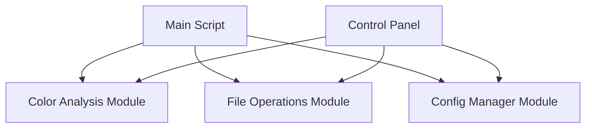

# Wallpaper Color Manager - Implementation Plan

This document outlines the detailed implementation plan for the new wallpaper color manager system.

## 1. System Components

### 1.1 Core Modules



#### 1.1.1 Color Analysis Module (`utils/color_analysis.py`)
- Responsible for analyzing image colors
- Implements pixel counting algorithm
- Determines color categories based on thresholds

#### 1.1.2 File Operations Module (`utils/file_operations.py`)
- Handles file system operations
- Creates and manages symlinks
- Resets color directories

#### 1.1.3 Config Manager Module (`utils/config_manager.py`)
- Manages configuration loading/saving
- Provides default settings
- Validates user inputs

#### 1.1.4 Main Script (`wallpaper_color_manager.py`)
- Orchestrates the overall process
- Can be run from command line
- Integrates all modules

#### 1.1.5 Control Panel (`color_control_panel.py`)
- Provides GUI for user interaction
- Visualizes sample images and their categorization
- Allows threshold adjustments

### 1.2 Data Structures

#### 1.2.1 Configuration (`config.json`)
```json
{
  "color_thresholds": {
    "red": 10,
    "orange": 10,
    "green": 10,
    "blue": 10,
    "pink": 10,
    "yellow": 10,
    "white_gray_black": 10
  },
  "sample_images_dir": "sample_images",
  "resize_dimensions": [100, 100],
  "paths": {
    "base_dir": "/home/twain/Pictures",
    "original_dir": "llm_baby_monster_original",
    "color_dirs": {
      "red": "llm_baby_monster_by_color/red",
      "orange": "llm_baby_monster_by_color/orange",
      "green": "llm_baby_monster_by_color/green",
      "blue": "llm_baby_monster_by_color/blue",
      "pink": "llm_baby_monster_by_color/pink",
      "yellow": "llm_baby_monster_by_color/yellow",
      "white_gray_black": "llm_baby_monster_by_color/white_gray_black"
    }
  }
}
```

#### 1.2.2 Image Analysis Result
```python
{
  "filename": "image.jpg",
  "color_percentages": {
    "red": 15.2,
    "orange": 5.6,
    "green": 25.3,
    "blue": 8.7,
    "pink": 2.1,
    "yellow": 12.8,
    "white_gray_black": 30.3
  },
  "categories": ["red", "green", "yellow", "white_gray_black"]
}
```

## 2. Implementation Steps

### 2.1 Setup Project Structure

1. Create directory structure
2. Initialize Python files with docstrings
3. Create default configuration file

### 2.2 Implement Core Modules

#### 2.2.1 Config Manager
1. Implement configuration loading/saving
2. Add validation functions
3. Create default configuration generator

#### 2.2.2 Color Analysis
1. Implement pixel categorization function
2. Create image analysis function
3. Add threshold comparison logic

#### 2.2.3 File Operations
1. Implement directory creation/verification
2. Add symlink management functions
3. Create reset functionality

### 2.3 Implement Main Script

1. Parse command line arguments
2. Implement main workflow
3. Add logging and error handling

### 2.4 Implement Control Panel

1. Create basic Tkinter interface
2. Implement threshold sliders
3. Add sample image visualization
4. Create color distribution display
5. Implement reset and run buttons

## 3. Detailed Component Specifications

### 3.1 Color Analysis Module

#### 3.1.1 Pixel Categorization
For each pixel, determine which color category it belongs to:

```python
def categorize_pixel(r, g, b):
    """
    Determine which color category a pixel belongs to.
    
    Args:
        r (int): Red value (0-255)
        g (int): Green value (0-255)
        b (int): Blue value (0-255)
        
    Returns:
        str: Color category name
    """
    # Implementation will use RGB distance or HSV classification
    # to determine the most appropriate color category
```

#### 3.1.2 Image Analysis
Process an entire image and count pixels in each category:

```python
def analyze_image(image_path, resize_dimensions=(100, 100)):
    """
    Analyze an image to determine its color distribution.
    
    Args:
        image_path (str): Path to the image file
        resize_dimensions (tuple): Dimensions to resize image for analysis
        
    Returns:
        dict: Color percentages and categories
    """
    # Implementation will:
    # 1. Open and resize the image
    # 2. Count pixels in each category
    # 3. Calculate percentages
    # 4. Return results
```

#### 3.1.3 Threshold Comparison
Compare color percentages against thresholds:

```python
def apply_thresholds(color_percentages, thresholds):
    """
    Determine which categories an image belongs to based on thresholds.
    
    Args:
        color_percentages (dict): Percentage of each color in the image
        thresholds (dict): Threshold percentage for each color
        
    Returns:
        list: Categories the image belongs to
    """
    # Implementation will compare each percentage against its threshold
    # and return a list of categories that meet or exceed their thresholds
```

### 3.2 Control Panel

#### 3.2.1 Main Window Layout

```
+-----------------------------------------------+
|  Wallpaper Color Manager - Control Panel      |
+-----------------------------------------------+
|                                               |
|  +-------------------+ +-------------------+  |
|  | Sample Image      | | Color Distribution|  |
|  |                   | |                   |  |
|  |                   | | [Bar Chart]       |  |
|  |                   | |                   |  |
|  |                   | |                   |  |
|  +-------------------+ +-------------------+  |
|                                               |
|  Categories: [Red] [Green] [White/Gray/Black] |
|                                               |
|  +-------------------------------------------+  |
|  | Color Thresholds                          |  |
|  |                                           |  |
|  | Red:     [===========|------] 55%         |  |
|  | Orange:  [=====|----------------] 25%     |  |
|  | Green:   [========|-------------] 40%     |  |
|  | Blue:    [====|------------------] 20%    |  |
|  | Pink:    [===|-------------------] 15%    |  |
|  | Yellow:  [======|--------------] 30%      |  |
|  | W/G/B:   [==========|--------] 50%        |  |
|  |                                           |  |
|  +-------------------------------------------+  |
|                                               |
|  [< Prev Image]                [Next Image >] |
|                                               |
|  [Reset Categories]            [Run Analysis] |
|                                               |
+-----------------------------------------------+
```

#### 3.2.2 Sample Image Navigation
- Allow cycling through all images in the sample_images directory
- Update color analysis in real-time when changing images
- Show filename and dimensions

#### 3.2.3 Color Distribution Display
- Show bar chart of color percentages
- Highlight bars that exceed their threshold
- Display percentage values

#### 3.2.4 Threshold Sliders
- One slider per color category
- Range from 0% to 100%
- Update in real-time
- Save changes automatically

#### 3.2.5 Action Buttons
- Reset Categories: Clear all color folders
- Run Analysis: Process all images with current settings

## 4. Implementation Timeline

### Week 1
- Day 1-2: Setup project structure and implement config manager
- Day 3-4: Implement color analysis module
- Day 5: Implement file operations module

### Week 2
- Day 1-2: Implement main script
- Day 3-5: Implement control panel
- Day 6-7: Testing and refinement

## 5. Testing Strategy

### 5.1 Unit Tests
- Test each module function independently
- Verify correct behavior with edge cases

### 5.2 Integration Tests
- Test interactions between modules
- Verify end-to-end workflows

### 5.3 User Testing
- Test with various sample images
- Verify control panel usability

## 6. Future Enhancements

### 6.1 Potential Improvements
- Add machine learning for better color categorization
- Implement batch processing for large image collections
- Add image search functionality
- Create a web interface

### 6.2 Performance Optimizations
- Implement caching of analysis results
- Add parallel processing for multiple images
- Optimize image resizing for faster analysis