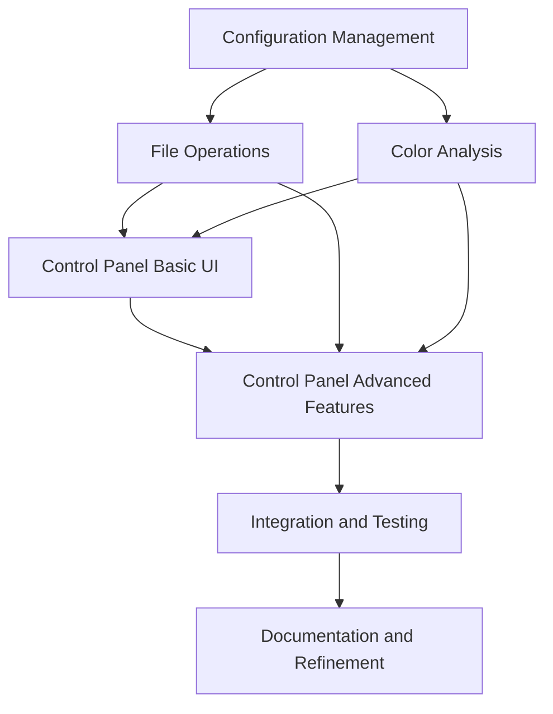

# Wallpaper Color Manager - Implementation Roadmap

This document provides a roadmap for implementing the new Wallpaper Color Manager system.

## Project Overview

The new Wallpaper Color Manager system will replace the existing system with a more flexible and user-friendly approach to categorizing wallpaper images based on their color content. The key improvements include:

1. Pixel-based color analysis instead of color ranges
2. Configurable thresholds for each color category
3. A visual control panel for adjusting settings
4. Sample image visualization for threshold tuning
5. Reset and run functionality

## Implementation Phases

### Phase 1: Core Infrastructure

**Estimated Time: 2-3 days**

1. Create project directory structure
2. Implement configuration management
3. Implement basic file operations
4. Create utility functions

#### Deliverables:
- Directory structure setup
- Configuration loading/saving functionality
- Basic file operations (directory creation, symlink management)
- Utility functions for logging, error handling, etc.

### Phase 2: Color Analysis Module

**Estimated Time: 2-3 days**

1. Implement pixel categorization algorithm
2. Create image analysis functions
3. Implement threshold application
4. Add caching for performance

#### Deliverables:
- Pixel categorization function
- Image analysis function
- Threshold application function
- Performance optimizations

### Phase 3: Control Panel Basic UI

**Estimated Time: 3-4 days**

1. Create main window layout
2. Implement threshold sliders
3. Add sample image display
4. Create basic navigation controls

#### Deliverables:
- Functional Tkinter UI
- Threshold adjustment sliders
- Sample image display
- Navigation buttons

### Phase 4: Control Panel Advanced Features

**Estimated Time: 2-3 days**

1. Implement color distribution visualization
2. Add category indicators
3. Create reset functionality
4. Implement run analysis functionality

#### Deliverables:
- Color distribution chart
- Category indicators
- Reset button functionality
- Run analysis button functionality

### Phase 5: Integration and Testing

**Estimated Time: 2-3 days**

1. Integrate all components
2. Implement end-to-end workflows
3. Add error handling and recovery
4. Perform comprehensive testing

#### Deliverables:
- Fully integrated system
- Error handling for all operations
- Comprehensive logging
- Test results

### Phase 6: Documentation and Refinement

**Estimated Time: 1-2 days**

1. Complete user documentation
2. Add code documentation
3. Refine UI based on testing
4. Optimize performance

#### Deliverables:
- User manual
- Code documentation
- Refined UI
- Performance optimizations

## Implementation Dependencies



## Development Approach

### 1. Incremental Development

- Implement one module at a time
- Test each module thoroughly before moving to the next
- Use version control to track changes

### 2. Test-Driven Development

- Write tests before implementing features
- Ensure all functions have appropriate test coverage
- Automate testing where possible

### 3. User-Centered Design

- Focus on usability and user experience
- Get feedback early and often
- Iterate based on user feedback

## Technical Stack

- **Language**: Python 3.x
- **GUI Framework**: Tkinter
- **Image Processing**: PIL/Pillow
- **Visualization**: matplotlib (for color distribution charts)
- **Testing**: unittest or pytest

## File Structure

```
wallpaper_color_manager_new/
├── wallpaper_color_manager.py       # Main script
├── color_control_panel.py           # Control panel GUI
├── config.json                      # Configuration file
├── reset_categories.py              # Reset script
├── README.md                        # Documentation
├── sample_images/                   # Sample images directory
├── tests/                           # Test directory
│   ├── test_color_analysis.py
│   ├── test_file_operations.py
│   └── test_config_manager.py
└── utils/                           # Utility modules
    ├── __init__.py
    ├── color_analysis.py
    ├── file_operations.py
    └── config_manager.py
```

## Implementation Details

### 1. Configuration Management

The configuration manager will:
- Load settings from config.json
- Provide default values for missing settings
- Validate configuration values
- Save updated settings back to the file

### 2. Color Analysis

The color analysis module will:
- Categorize pixels using HSV color space
- Count pixels in each category
- Calculate percentages
- Apply thresholds to determine categories

### 3. File Operations

The file operations module will:
- Create and manage directory structure
- Create and manage symlinks
- Reset color categories
- Handle file system errors

### 4. Control Panel

The control panel will:
- Provide a user-friendly interface
- Display sample images and their color distributions
- Allow adjustment of thresholds
- Provide reset and run functionality

## Testing Strategy

### 1. Unit Testing

- Test each function in isolation
- Verify correct behavior with various inputs
- Test error handling and edge cases

### 2. Integration Testing

- Test interactions between modules
- Verify end-to-end workflows
- Test with real file system structures

### 3. User Testing

- Test with real users
- Gather feedback on usability
- Identify and fix issues

## Deployment Strategy

### 1. Initial Deployment

- Deploy alongside existing system
- Allow users to try the new system without disrupting existing workflows
- Gather feedback and make improvements

### 2. Full Deployment

- Once the new system is stable and well-tested, replace the existing system
- Provide migration path for existing data
- Offer training and documentation

## Success Criteria

The implementation will be considered successful if:

1. Images are correctly categorized based on their color content
2. Users can easily adjust thresholds to fine-tune categorization
3. The system is reliable and handles errors gracefully
4. Performance is acceptable even with large image collections
5. Users find the control panel intuitive and helpful

## Risk Management

### 1. Technical Risks

- **File System Compatibility**: Test on different file systems and handle differences
- **Performance Issues**: Optimize for large image collections
- **Dependency Changes**: Minimize external dependencies

### 2. Project Risks

- **Scope Creep**: Maintain focus on core requirements
- **Timeline Slippage**: Build in buffer time for unexpected issues
- **Resource Constraints**: Prioritize features based on value

## Next Steps

1. Set up project structure
2. Implement configuration management
3. Begin work on color analysis module
4. Create basic control panel UI

## Conclusion

This roadmap provides a comprehensive plan for implementing the new Wallpaper Color Manager system. By following this plan, we can create a system that addresses the limitations of the existing system and provides a more flexible and user-friendly approach to categorizing wallpaper images based on their color content.